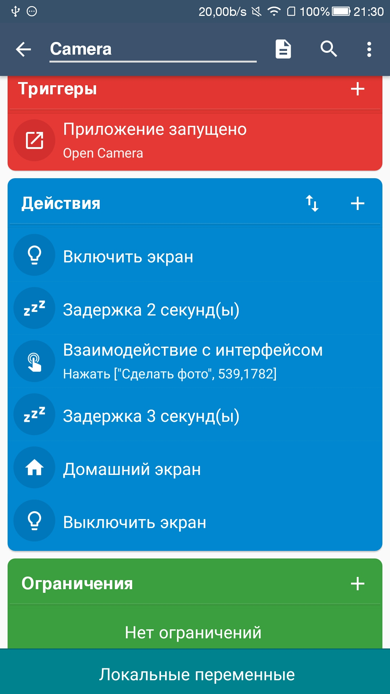

# OLxA-Vision  
CV in OLxA architectures  

Для ленивых [здесь](https://drive.google.com/file/d/1HsPQv2CmZWNwvNqVni8zJpNWvrsp4QRh/view?usp=sharing) лежит версия для Windows.

## Что потребуется:
1. Компьютер (Windows или Linux, с USB или Wi-Fi).  
2. Android-смартфон (должна быть включена отладка по USB).  
3. USB-шнур.  

## Как работает приложение сейчас:  
1. Python-приложение с помощью ADB (Android Debug Bridge) запускает на смартфоне приложение Open Camera.  
2. Android-приложение для автоматизации MacroDroid делает снимок.  
3. Python-приложение с помощью ADB копирует содержимое папки со снимками на ПК.  
4. Python-приложение с помощью ADB очищает содержимое папки со снимками.  
  
## Поясню почему выбраны именно эти программные продукты:  
Python - на этом языке я не писал приложений. Но, самая популярная на мой взгляд библиотека для компьютерного зрения OpenCV, именно для Python. Чтобы не плодить зоопарк языков и пользователям OpenCV было удобно.  
Open Camera - из названия понятно, что открытая. Это позволяет "кастомизировать" ее в своих целях. Также для того, чтобы была единообразная практика использования этой системы. Чтобы проблемы кучи различных приложений, различных производителей не мешали ее использовать.  
MacroDroid - единственное приложение в этом роде, которое я использовал. Показалось очень функциональным и простым в использовании.  

## Настройка смартфона:  
1. Устанавливаем Open Camera. Активируем настройку "Камера на экране блокировки"  
2. Устанавливаем MacroDroid. Даем ему все разрешения.  
3. Настраиваем автоматизацию. Примерно так:  

 

4. Запускаем Open Camera и проверяем, сделался ли снимок.  

## Настройка программы на компьютере:

1. Качаем Android SDK Platform Tools. https://dl.google.com/android/repository/platform-tools-latest-windows.zip (если пользуемся exe-программой на винде, то этого делать не надо) 
2. Распаковываем и заходим через консоль в его папку. (если пользуемся exe-программой на винде, то через консоль надо зайти в папку platform-tools).  
3. Узнаем имя и активити Open Camera в системе Android следующей командой. Не знаю точно, но Open Camera скорей всего должна быть запущена.  
`adb shell dumpsys activity activities`  
Ищем в результате запроса что-то вроде "net.sourceforge.opencamera/.MainActivity". Это Имя/Активити.
4. Пробуем запустить Open Camera из командной строки следующей командой:  
`adb shell am start -n Имя/Активити`
5. Заходим в файл settings.json и записывам туда Имя/Активити. Путь куда сохраняет Open Camera снимки. Путь на компьютере, куда будем перемещать файлы.
6. Помещаем папку platform-tools из скачанной SDK Platform Tools рядом со скриптом olxa_vision.py (если пользуемся exe-программой на винде, то все уже сделано за вас) и скрипт должен работать.